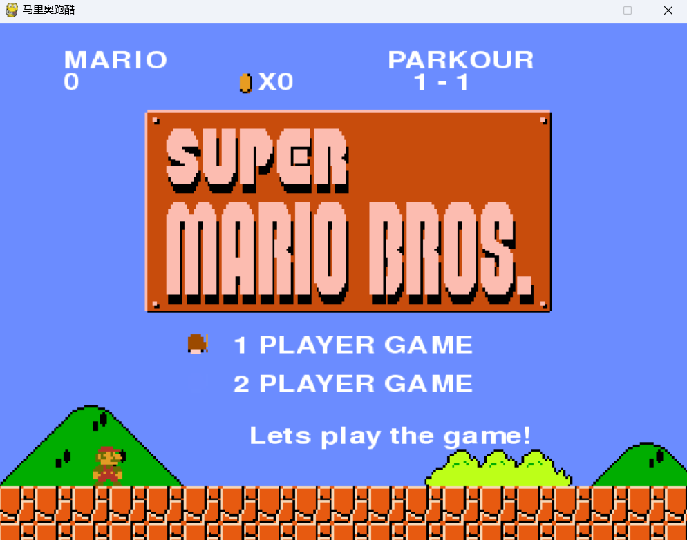

# 马里奥跑酷



​	   本项目《马里奥跑酷》是基于python中的pygame库实现的一款类跑酷游戏。

      ​适用场景：本人在大二时候完成的课程设计。此项目适用于作为本科阶段**课程设计**、**程序设计**、**python编程**、**小游戏开发**等用途，供大家学习交流使用，若有用麻烦点一个star！

## 操作说明


1. 配置好的python环境下，仅需要安装pygame

   ```
   pip install pygame
   ```

2. 运行main.py文件

   ```
   python main.py
   ```

3. 游戏主菜单时，上下选择模式（目前仅开发出单人模式，选择双人模式仍为单人）

4. 回车键开始游戏

## 游戏介绍


1. 主人公通过键盘左右键移动，空格键跳跃
2. 碰到金币会收集起来，获得2积分
3. 从正上方落下会踩死虫子，会获得2个积分，左右碰撞到会减少一次生命
4. 踩空会减少一次生命
5. 游戏中会出现水管，砖块，地板等障碍物，无其他作用
6. 一次游戏总共有三条生命，生命数为0时游戏结束，Game over
7. 最终到达城堡游戏成功

## 文件说明

- resources存储游戏所需图片和音效
- state包括三个游戏中需要的三个界面文件（.py）
- sprite包括两个精灵类
- source包括游戏初始化一些工具型文件，const.py存储常量值
- 日志文件为自己写软件和debug过程中的一些笔记（自己随便写的）

